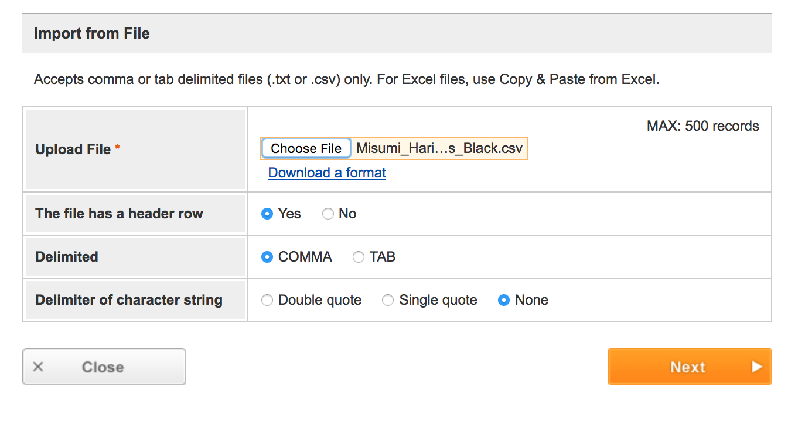

# Introduction
Regardless of whether you are upgrading from an existing Original Prusa i3 MK2,
or building a 3030 Haribo Edition from scratch, you will need to order aluminum
extrusions, smooth rods, t-slot nuts. Our current recommended source for these
parts (for those living in the US) is from [Misumi USA](https://www.misumi-ec.com/us).

To make the Misumi ordering process simpler, we have put together a CSV (Comma-separated Value) file containing all of the parts for the 3030 Haribo Edition. This file can be uploaded to your Misumi cart using the instructinos below.

# 1. Pick your color!
Decide whether you would like a silver frame or a black frame. Choose a color and then download the appropriate corresponding CSV file below based on your selection.

- [Silver 3030 Frame CSV File](./Misumi_Haribo_Upgrade_Parts_Silver.csv)
- [Black 3030 Frame CSV File](./Misumi_Haribo_Upgrade_Parts_Black.csv)

# 2. Do you also want an integrated spool holder?
If you would like to also build a spool holder, you can also download a CSV file containing those additional parts below:

- [Silver](./Misumi_Haribo_SpoolHolder_Silver.csv)
- [Black](./Misumi_Haribo_SpoolHolder_Black.csv)

# 3. Order the parts!

- **Step 1.** Register an account with Misumi [here](https://us.misumi-ec.com/contents/regist/)
- **Step 2.** Login to your Misumi account.
- **Step 3.** Select the "Order" link at the top of the page.

- **Step 4.** Scroll down to the bottom of the "Create Order Request" page and click "Import from File".

- **Step 5**. On the "Import From File", select "Choose File" and select the CSV for the main Haribo parts that you previously downloaded. This file should begin in "Misumi_Haribo_Upgrade_Parts_". If you also downloaded the spool holder CSV, repeat this process once you have finished importing the first CSV file by returning to Step 4.

- **Step 6.** On the "Import From File" screen, verify you select the following options:
  - **This file has a header row**: `Yes`
  - **Delimited**: `COMMA`
  - **Delimiter of character string**: `None`
- **Step 7.** Click 'Next' on the "Import from File" screen.
- **Step 8.** Click 'Next' on the "Set Item" screen.

- **Step 9.** The items should now be in your cart.
- **Step 10.** If you would like to upload the CSV for the Optional Spool Holder, continue back to **Step 4**. Otherwise, continue to **Step 11**.
- **Step 11.** Continue to fill out the remainder of the Order Form and submit your Misumi order. Congrats on ordering your Haribo parts!

